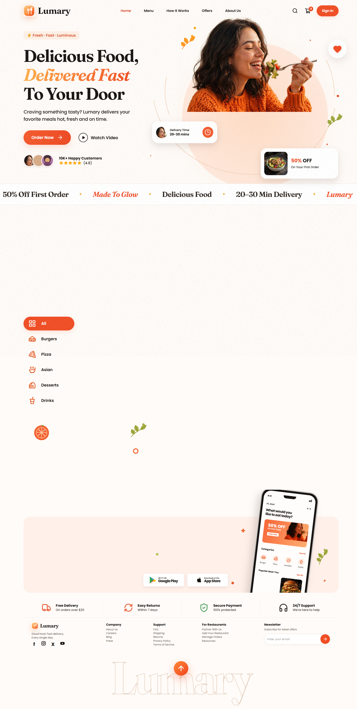

# Lumary Food 🍔

A premium food delivery web application built with React 19, Vite, Tailwind CSS v4, and Framer Motion. Features a luminous brand identity with amber/orange gradients, custom cursor interactions, and smooth scroll-triggered animations.

## 🎨 Brand Identity

### Color Palette
| Color | Hex | Usage |
|-------|-----|-------|
| **Lumary Gold** | `#ffd27a` | Primary gradient start |
| **Lumary Amber** | `#ff8a3a` | Primary gradient mid |
| **Lumary Coral** | `#ec4019` | Primary gradient end / CTAs |
| **Cream** | `#fff9f0` | Background base |
| **Ink** | `#1a1612` | Primary text |

### Logo / Brand Mark
The **LumaryBadge** is a custom SVG logo featuring:
- Rounded square with amber→coral gradient
- Stylized "L" monogram with white strokes
- Floating sparkle accent
- Used across header, preloader, app badge, and footer

### Typography
- **Display**: System UI / Custom (via `zesty.css`)
- **Body**: System UI stack
- **Line Reveal**: Custom animated text entrance effect

---

## ✨ Key Features

| Feature | Description |
|---------|-------------|
| **Custom Cursor** | Magnetic dot + ring with hover states |
| **Preloader** | Animated Lumary badge with spring entrance |
| **Scroll Progress** | Top bar indicating page scroll depth |
| **Hero Parallax** | Mouse-following hero image with floating elements |
| **Tilt Cards** | 3D tilt on food cards with glare effect |
| **Magnetic Buttons** | Cursor-attracting interactive elements |
| **Marquee** | Infinite scrolling brand messages |
| **Cart Drawer** | Slide-out cart with quantity controls |
| **Video Modal** | Pexels video player with custom controls |
| **Auth/Waitlist Modals** | Accessible dialogs with form validation |

---

## 📸 Visual Preview

### Live Deployment Screenshot

*Complete live deployment showing: Hero with parallax & stats, Marquee, Why Choose Us, Menu with tilt cards & category filter, Testimonials carousel, App Download with phone mockup, Service strip, Footer*

### Key UI Sections (from live deployment)

| Section | Features |
|---------|----------|
| **Hero** | Parallax woman illustration, animated counters (10K+ customers, 4.8★), floating leaves, heart favorite button, delivery/offer floating cards |
| **Marquee** | Infinite scrolling "Delicious Food · 20–30 Min Delivery · Lumary · Fire-Fresh Kitchens · 50% Off First Order · Made To Glow" |
| **Why Choose Us** | 3 illustrated features: Scooter (Lightning Fast), Bowl (Wide Variety), Medal (Top Quality) with scroll reveal |
| **Menu** | Category tabs (All/Burgers/Pizza/Asian/Desserts/Drinks), 3D tilt food cards, favorite hearts, discount badges, ratings, slide pagination |
| **Testimonials** | Auto-rotating carousel (7.5s), customer avatars, 5-star ratings, quote cards, navigation dots/arrows |
| **App Download** | Animated phone mockup with floating animation, Google Play/App Store badges, gradient background |
| **Footer** | Brand, newsletter signup, 4-column links, social icons |

---

## 🛠 Tech Stack

```
React 19.2.6          │  Framer Motion 14
Vite 7.3.2            │  Tailwind CSS 4.1.17
TypeScript 5.9.3      │  Lucide React 1.52
vite-plugin-singlefile│  clsx + tailwind-merge
```

---

## 🚀 Getting Started

```bash
# Install dependencies
npm install

# Development server
npm run dev

# Production build
npm run build

# Preview build
npm run preview
```

---

## 📁 Project Structure

```
lumary-food/
├── public/
│   └── images/           # Food photography & illustrations
├── src/
│   ├── components/
│   │   ├── Artwork.tsx   # All brand illustrations & UI primitives
│   │   └── ...
│   ├── hooks/            # Custom hooks (useMediaQuery, etc.)
│   ├── utils/
│   │   └── cn.ts         # Classname utility
│   ├── App.tsx           # Main application (495 lines)
│   ├── index.css         # Tailwind imports
│   ├── main.tsx          # Entry point
│   └── zesty.css         # Custom animations & utilities
├── index.html
├── package.json
├── tsconfig.json
└── vite.config.ts
```

---

## 🎯 Brand Components (from `Artwork.tsx`)

| Component | Purpose |
|-----------|---------|
| `LumaryBadge` | Logo mark with gradient |
| `Brand` | Clickable logo link |
| `Cursor` | Custom cursor system |
| `Magnetic` | Hover attraction wrapper |
| `Tilt` | 3D card tilt with glare |
| `Counter` | Animated number counter |
| `LineReveal` | Staggered text entrance |
| `Marquee` | Infinite scrolling banner |
| `Reveal` | Scroll-triggered fade-up |
| `ScooterIllustration` | Delivery feature icon |
| `BowlIllustration` | Variety feature icon |
| `MedalIllustration` | Quality feature icon |
| `LeafIllustration` | Decorative leaf |
| `TomatoIllustration` | Decorative tomato |
| `Avatar` | User avatar variants |
| `Stars` | 5-star rating display |
| `Dialog` | Accessible modal base |
| `PhoneMockup` | App preview phone frame |

---

## 🌐 Deployed

**Vercel**: https://lumary-food-lubirges-projects.vercel.app

**GitHub**: https://github.com/lubirge777-star/lumary-food

---

## 📄 License

MIT License - Built as a design showcase for Lumary brand system.